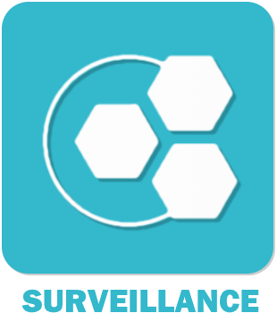

# Plugin ethalsurveillance pour Jeedom

Plugin servant à la surveillance d’un équipement.

### Market

Retrouvez le sur le Market Jeedom [ici](https://www.jeedom.com/market/index.php?v=d&p=market&type=plugin&&name=ethalsurveillance)

### Documentation

Vous trouverez la documentation [ici](https://Jeedom-Plugins-Extra.github.io/plugin-ethalsurveillance/fr_FR/)

### Prévisualisation

### Forum

Lien vers le forum [ici](https://www.jeedom.com/forum/viewtopic.php?f=144&t=24637)

### Chatroom

Lien vers le chat [ici](https://gitter.im/Jeedom-Plugins-Extra/plugin-ethalsurveillance)

### Fonctions disponibles

Infos :
* Etat,Alarme,heure de activation et de désactivation, temps de fonctionnement,compteur.

Actions :
* Sur le changement d'état ou sur alarme (cf la doc du plugin)

Scénarios possible (ceux que j'ai chez moi) :
* Compte le nombre de cycle de ma machine à laver, Madame s'en sert pour savoir quand il faut faire un cyle de nettoyage.

## <a href="https://creativecommons.org/licenses/by-sa/4.0/"> Team Jeedom-Plugins-Extra </a> 👍 
### Retour à l'accueil du [Wiki](https://github.com/Jeedom-Plugins-Extra/Jeedom-Plugins-Extra/wiki) ou de la [Team](https://github.com/Jeedom-Plugins-Extra)

