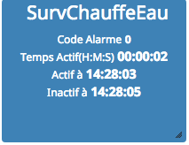
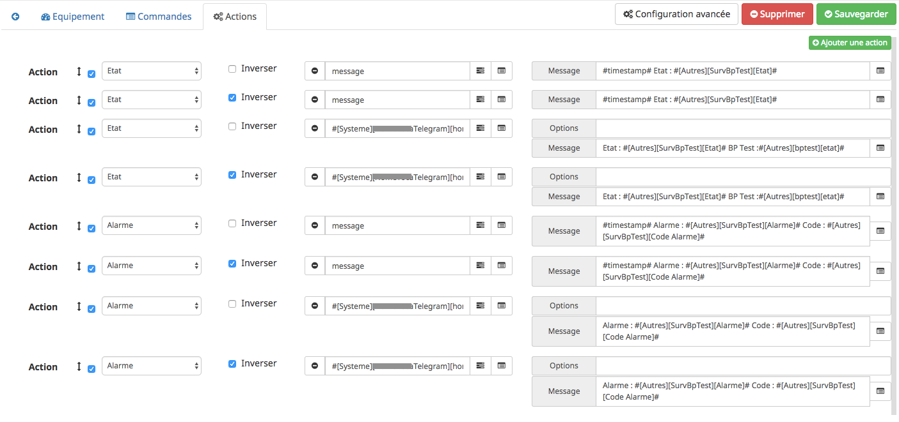

# Plugin Surveillance Equipement (id : ethalsurveillance) Description

Plugin servant à la surveillance d’un équipement.

# Présentation

La surveillance de l’équipement est faite à partir d’une commande ***Lo*** (ie etat,…) ou d’une commande de mesure ***analogique*** (puissance,temperature,…)

Il permet de connaître le temps où la commande de l’équipement est active,+ il gère une commande d’alarme, en fonction d’un temps minimun et/ou maximun où la commande de l’équipement est active, d’une heure prévue où la commande de l’équipement est inactif ou actif, d’une valeur haute sur un compteur,ces paramètres sont disponible pour une gestion hebdomadaire.

Un code d’alarme, permet de connaître la cause de l’alarme,
Un compteur de cycle d’activité de l’équipement,
Des actions peuvent etre configurer en fonction de la valeur des commandes Etat et Alarme.

Ci dessous des exemples de widget.

Un panel pour la visualisation graphique du temps d’activité de l’équipement est disponible depuis le menu Acceuil→Surveillance Equipement

# Configuration

## Onglet Equipement
 * Type de commande : Type de la commande qui servira à surveiller l’équipement , Logique ou Analogique,

   * Commande de l’équipement à surveiller de type "Logique"
  
  
  
 * ***Commande équipement*** : Commande d’état de l’équipement à surveiller

 * ***Inverser*** : Inversion de la commande d’état de l’équipement à surveiller

 * ***Temps mini surveillance active (min)*** : Temps de surveillance minimun de l’équipement pour générer une alarme, laisser vide pour ne pas générer d’alarme

 * ***Temps max surveillance active (min)*** : Temps de surveillancet maximun de l’équipement pour générer une alarme, laisser vide pour ne pas générer d’alarme

 * ***Heure prévue surveillance inactive (HHMM)*** : heure à laquelle l’équipement (ie la commande ***Etat***) est prévu d’être à OFF, laisser vide pour ne pas générer d’alarme

 * ***Heure prévue surveillance active (HHMM)*** : heure à laquelle l’équipement (ie la commande ***Etat***) est prévu d’être à ON, laisser vide pour ne pas générer d’alarme

 * ***Valeur compteur haut*** : Valeur haute du compteur pour générer une alarme, laisser vide pour ne pas générer d’alarme

   * Commande de l’équipement à surveiller de type "Analogique" avec Compteur Général coché
  
  
  
 * ***Commande équipement*** : Commande de mesure analogique de l’équipement à surveiller
 
 * ***Compteur Général*** : coché si la Commande équipement est une mesure analogique globale (ie mesure de puissance globale de votre logement)

 * ***Heure de surveillance prévue +/- 2 min (HHMM)*** : obligatoire si ***Compteur Général*** coché

 * ***Valeur surveillance active*** : obligatoire si ***Compteur Général*** coché, doit être vide dans le cas contraire

 * ***Temps mini surveillance active (min)*** : Temps de surveillance minimun de l’équipement pour générer une alarme, laisser vide pour ne pas générer d’alarme

 * ***Temps max surveillance active (min)*** : Temps de surveillance maximun de l’équipement pour générer une alarme, laisser vide pour ne pas générer d’alarme

 * ***Valeur compteur haut*** : Valeur haute du compteur pour générer une alarme, laisser vide pour ne pas générer d’alarme
 
   * Commande de l’équipement à surveiller de type "Analogique" avec Compteur Général NON coché
   
   

 * ***Commande équipement*** : Commande de mesure analogique de l’équipement à surveiller

 * ***Compteur Général*** : NON coché

 * ***Valeur surveillance inactive*** : obligatoire si ***Compteur Général*** NON coché, valeur analogique en dessous de laquelle l’équipement à surveiller est considéré inactif (voir également la description de Délai valeur surveillance inactive (min) ci dessous

 * ***Délai valeur surveillance inactive (min)*** : Delai en minute pour lequel la ***valeur surveillance inactive*** est considéré comme valide

 * ***Valeur surveillance active*** : obligatoire si ***Compteur Général*** NON coché, valeur analogique au dessus de laquelle l’équipement à surveiller est considéré actif

 * ***Temps mini surveillance active (min)*** : Temps de surveillance minimun de l’équipement pour générer une alarme, laisser vide pour ne pas générer d’alarme

 * ***Temps max surveillance active (min)*** : Temps de surveillance maximun de l’équipement pour générer une alarme, laisser vide pour ne pas générer d’alarme

 * ***Heure prévue surveillance inactive (HHMM)*** : heure à laquelle l’équipement (ie commande ***Etat***) est prévu d’être à OFF, laisser vide pour ne pas générer d’alarme

 * ***Heure prévue surveillance active (HHMM)*** : heure à laquelle l’équipement (ie commande ***Etat***) est prévu d’être à ON,laisser vide pour ne pas générer d’alarme

 * ***Valeur compteur haut*** : Valeur haute du compteur pour générer une alarme, laisser vide pour ne pas générer d’alarme

> **Note**
>
> Les valeurs definit dans les onglets des jours de la semaine sont prioritaires à celles définit dans l’onglet défaut

> **Note**
>
> Il peut y avoir une latence de 5 minutes au déclenchement de l’alarme sur les paramètres ***Heure prévue surveillance Inactif (HHMM)*** et ***Heure prévue surveillance Actif (HHMM)***

> **Important**
>
> La commande équipement doit être de type "info et de sous type "numeric" pour un ***Type de commande*** analogique, la commande équipement doit être de type "info et de sous type "binary" pour un ***Type de commande*** logique

> **Important**
>
> Vous ne pouvez créer qu’un seul équipement à surveiller avec l’option ***Compteur Général***, (ie une mesure de puissance globale de votre logement par exemple).
   
## Onglet Commande

Les commandes sont crées automatiquement à la sauvegarde de l’équipement, il n’est pas possible d’en ajouter, d’en supprimer. Utiliser la case à cocher ***afficher***, si vous ne souhaitez pas voir certaines commandes sur le widget.

 * ***Alarme*** : statut d’alarme de l’équipement (1 = ALARME = ON, 0 = OFF)

 * ***Code Alarme*** : somme des codes d’alarme ayant déclenchés l’alarme , voir ci-dessous les valeurs des codes d’alarme

 * ***Temps Actif(H:M:S)*** : Temps d’activité de l’équipement au format Heure:Minute:Seconde

 * ***Temps Actif*** : Temps d’activité de l’équipement en secondes

 * ***Temps Actif Total(H:M:S)*** : Temps d’activité de l’équipement au format Heure:Minute:Seconde

 * ***Temps Actif Total*** : Temps d’activité de l’équipement en secondes

 * ***RAZ Tps Actif Total*** : remise à zero du temps d’activité total (commande ***Temps Actif Total(H:M:S)*** et ***Temps Actif Total***)

 * ***Actif à*** : heure à laquelle la commande Etat est passé à ON

 * ***Inactif à*** : heure à laquelle la commande Etat est passé à OFF

 * ***Etat*** : statut de surveillance de l’équipement (1 = ON(active), 0 = OFF(inactive))

 * ***Compteur*** : nombre de passage de la commande Etat de OFF à ON

 * ***Compteur +*** : incrémentation du compteur de 1

 * ***Compteur -*** : décrémentation du compteur de 1

 * ***RAZ Compteur*** : remise à zéro de la commande Compteur

 * ***RAZ Tout*** : remise à zéro de la commande ***Compteur*** et du temps d’activité total (commande ****Temps Actif Total(H:M:S)*** et ***Temps Actif Total***)
 
> **Note**
>
>Pour historiser le temps d’activité d’un équipément, la commande ***Etat*** est historisée par défaut avec l’option Mode de lissage sur Aucun. Ces options sont disponible depuis le menu historique.

## Onglet Actions

Cet onglet permet la configuration d’action en fonction de la valeur de la commande ***Etat*** et ***Alarme***.

La case à cocher ***Inverser***, inverse le sens de la commande ***Etat*** ou ***Alarme***

Exemple:

Sélection ***Etat*** et case ***Inverser*** non cocher, l’action est effectué si la commande ***Etat*** passe de OFF à ON,

Sélection ***Etat*** et case ***Inverser*** cocher, l’action est effectué si la commande ***Etat*** passe de ON à OFF,

Idem pour la sélection Alarme
